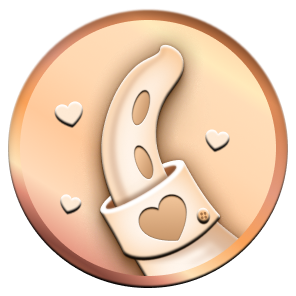
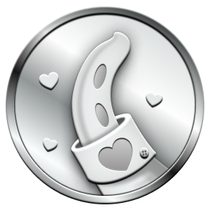
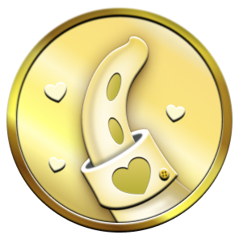
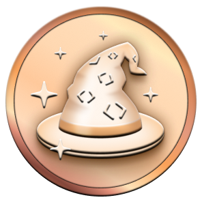

**<h1 align="center">Prasy Ikuzo</h1>**

<div align="center">
  <picture>
  <!-- TODO I couldn't figure out how to properly add local links in place of these images. These should be fixed later. - @PrasyIkuzo !-->
    <source media="(prefers-color-scheme: light)" srcset="https://user-images.githubusercontent.com/65187002/172940015-d9d072e7-c47d-4ddd-83f6-8e7717a721b8.png">
    
  </picture><br>
  <picture>
    <source media="(prefers-color-scheme: light)" srcset="https://user-images.githubusercontent.com/65187002/172941127-4061fac1-736b-4c24-b7ea-c210b3578cc5.png">
    
  </picture>
</div>

##  GITHUB ACHIEVEMENTS 


## 🍻 **Buy Me A Coffee**
<a href="https://saweria.co/PrasyIkuzo" target="_blank"></a>
[](https://saweria.co/PrasyIkuzo)

___________________________________________________________________

## 🏅 **Displaying Achievements** 🏅

 Displaying achievements on your profile is completely optional : by default, they can be seen by anyone viewing your public profile. 

> [!WARNING]  
> **You can opt out from having achievements displayed on your profile by going to your** [Profile Settings](https://github.com/settings)

___________________________________________________________________

##  **Obtainable Achievements**
<br>

| Badge | Name | How To Get | Needed Amount | 
| :-: | :-: | :-: | :-: |
|  | Heart On Your Sleeve | (???) | <table>  <thead>  <tr>  <th>DEFAULT</th> <th>BRONZE</th>  <th>SILVER</th>  <th>GOLD</th>  </tr>  </thead>  <tbody>  <tr>  <td align="center"></td>   <td></td>  <td></td>  <td></td>  </tr>  <tr>  <td align="center">(?)</td>  <td align="center">(?)</td>  <td align="center">(?)</td>  <td align="center">(?)</td>  </tr>   </tbody>  </table> |
|  | Open Sourcerer | (???) | <table>  <thead>  <tr>  <th>DEFAULT</th> <th>BRONZE</th>  <th>SILVER</th>  <th>GOLD</th>  </tr>  </thead>  <tbody>  <tr>  <td align="center"></td>   <td></td>  <td></td>  <td></td>  </tr>  <tr>  <td align="center">(?)</td>  <td align="center">(?)</td>  <td align="center">(?)</td>  <td align="center">(?)</td>  </tr>   </tbody>  </table> |
|                  | Starstruck         | Created a repository that has many stars | <table>  <thead>  <tr>  <th>DEFAULT</th> <th>BRONZE</th>  <th>SILVER</th>  <th>GOLD</th>  </tr>  </thead>  <tbody>  <tr>  <td align="center"></td>   <td></td>  <td></td>  <td></td>  </tr>  <tr>  <td align="center">16</td>  <td align="center">128</td>  <td align="center">512</td>  <td align="center">4096</td>  </tr>   </tbody>  </table>      |
|                  | Quickdraw        | Gitty up!<br>(closed an issue / pull request within 5 minutes of opening) | <table>  <thead>  <tr>  <th>DEFAULT</th>  </tr>  </thead>  <tbody>  <tr>  <td></td> </tr>  <tr>  <td align="center">1</td> </tr>   </tbody>  </table> |
|      | Pair Extraordinaire  | [Coauthored](https://docs.github.com/pull-requests/committing-changes-to-your-project/creating-and-editing-commits/creating-a-commit-with-multiple-authors) commits on merged pull request | <table>  <thead>  <tr>  <th>DEFAULT</th> <th>BRONZE</th>  <th>SILVER</th>  <th>GOLD</th>  </tr>  </thead>  <tbody>  <tr>  <td align="center"></td>   <td></td>  <td></td>  <td></td>  </tr>  <tr>  <td align="center">1</td>  <td align="center">10</td>  <td align="center">24</td>  <td align="center">48</td>  </tr>   </tbody>  </table>      |
|      | Pull Shark  | Opened a pull request that has been merged | <table>  <thead>  <tr>  <th>DEFAULT</th> <th>BRONZE</th>  <th>SILVER</th>  <th>GOLD</th>  </tr>  </thead>  <tbody>  <tr>  <td align="center"></td>   <td></td>  <td></td>  <td></td>  </tr>  <tr>  <td align="center">2</td>  <td align="center">16</td>  <td align="center">128</td>  <td align="center">1024</td>  </tr>   </tbody>  </table>      |
|  | Galaxy Brain | Answered a discussion<br>(got an accepted answer) | <table>  <thead>  <tr>  <th>DEFAULT</th> <th>BRONZE</th>  <th>SILVER</th>  <th>GOLD</th>  </tr>  </thead>  <tbody>  <tr>  <td></td>  <td></td>  <td></td>  <td></td>  </tr>  <tr>  <td align="center">2</td> <td align="center">8</td>  <td align="center">16</td>  <td align="center">32</td>  </tr>   </tbody>  </table>
|                  | YOLO        | Merged a pull request without a review | <table>  <thead>  <tr>  <th>DEFAULT</th>  </tr>  </thead>  <tbody>  <tr>  <td></td> </tr>  <tr>  <td align="center">1</td> </tr>   </tbody>  </table> |
|                  | Public Sponsor        | Sponsored an open source contributor through [GitHub Sponsors](https://github.com/sponsors) | <table>  <thead>  <tr>  <th>DEFAULT</th>  </tr>  </thead>  <tbody>  <tr>  <td></td> </tr>  <tr>  <td align="center">1</td> </tr>   </tbody>  </table> |

___________________________________________________________________

##  **Un-Obtainable Achievements**

Un-Obtainable Achievements are badges that were once available but can no longer be earned. These achievements are part of GitHub's history, showcasing milestones that are now preserved as legacy accomplishments. 

<br>

| Badge | Name | How To Get | Needed Amount | 
| :-: | :-: | :-: | :-: |
|      | Mars 2020 Contributor  | Contributed code to a repository used in the [Mars 2020 Helicopter Mission](https://github.com/readme/featured/nasa-ingenuity-helicopter) | <table>  <thead>  <tr>  <th>DEFAULT</th>  </tr>  </thead>  <tbody>  <tr>  <td></td> </tr>  <tr>  <td align="center">1</td> </tr>   </tbody>  </table> |
|  | Arctic Code Vault Contributor | Contributed code to a repository in the [2020 GitHub Archive Program](https://archiveprogram.github.com) | <table>  <thead>  <tr>  <th>DEFAULT</th>  </tr>  </thead>  <tbody>  <tr>  <td></td> </tr>  <tr>  <td align="center">1</td> </tr>   </tbody>  </table> |

___________________________________________________________________

## 👋 **Achievement Skin Tone**

#### Some achievements appearance depends on your Emoji Skin Tone Preference.

#### You can change your preferred Skin Tone by going to [Appearance Settings](https://github.com/settings/appearance)
<br>

| Badge | Name | Skin Tone Version | 
| :-: | :-: | :-: |
|                  | Starstruck         | <table>  <thead>  <tr>  <th>👋</th> <th>👋🏻</th>  <th>👋🏼</th>  <th>👋🏽</th>  <th>👋🏾</th>  <th>👋🏿</th>  </tr>  </thead>  <tbody>  <tr>  <td align="center"></td>   <td align="center"></td>  <td align="center"></td>  <td align="center"></td>  <td align="center"></td>   <td align="center"></td>   </tr>   <tr>  <td align="center">👋</td> <td align="center">👋🏻</td>  <td align="center">👋🏼</td>  <td align="center">👋🏽</td>  <td align="center">👋🏾</td>  <td align="center">👋🏿</td>  </tr>  </tbody>  </table>      |
|                  | Quickdraw         | <table>  <thead>  <tr>  <th>👋</th> <th>👋🏻</th>  <th>👋🏼</th>  <th>👋🏽</th>  <th>👋🏾</th>  <th>👋🏿</th>  </tr>  </thead>  <tbody>  <tr>  <td align="center"></td>   <td align="center"></td>  <td align="center"></td>  <td align="center"></td>  <td align="center"></td>   <td align="center"></td>   </tr>   <tr>  <td align="center">👋</td> <td align="center">👋🏻</td>  <td align="center">👋🏼</td>  <td align="center">👋🏽</td>  <td align="center">👋🏾</td>  <td align="center">👋🏿</td>  </tr>  </tbody>  </table>      |

___________________________________________________________________

#  **Tier Colors & Labels**

Every tier has either an x2, x3, or x4 label with it that also includes color. Here is the information about each one below :

| Tier | Label | Sample | Hex | Visual |
| --- | --- | --- | --- | --- |
Bronze 🥉 | x2 |  | #F9BFA7 | 
Silver 🥈 | x3 |  | #E1E4E4 | 
Gold 🥇 | x4 |  | #FAE57E | 

___________________________________________________________________

## ✨ **Highlights Badges**
<br>

|                                                                                                                                                          Badge                                                                                                                                                           |            Name            |                                                            How to get                                                             |
| :----------------------------------------------------------------------------------------------------------------------------------------------------------------------------------------------------------------------------------------------------------------------------------------------------------------------: | :------------------------: | :-------------------------------------------------------------------------------------------------------------------------------: |
|                                               |            Pro             |            Use [GitHub Pro](https://docs.github.com/en/get-started/learning-about-github/githubs-products#github-pro)             |
|      |  Developer Program Member  | Be a registered member of the [GitHub Developer Program](https://docs.github.com/en/developers/overview/github-developer-program) |
|  | Security Bug Bounty Hunter |                 Helped out hunting down security vulnerabilities at [GitHub Security](https://bounty.github.com/)                 |
|              |    GitHub Campus Expert    |                         Participate in the [GitHub Campus Program](https://education.github.com/experts)                          |
|      |  Security advisory credit  |          Have your security advisory submitted to the [GitHub Advisory Database](https://github.com/advisories) accepted          |

___________________________________________________________________

## 🛑 **Previous Version**

### 2021-04-19 - 2022-06-09

From the [start with Ingenuity on 2021-04-19](https://github.blog/2021-04-19-open-source-goes-to-mars/) until the [additions on 2022-06-09](https://github.blog/2022-06-09-introducing-achievements-recognizing-the-many-stages-of-a-developers-coding-journey/) , the first three Achievements had slightly different designs and name. In other words, they were overhauled on 2022-06-09.

```diff
- GitHub Sponsor
+ Public Sponsor

- Mars 2020 Helicopter Contributor
+ Mars 2020 Contributor
```

___________________________________________________________________

## 🔭 **Credits**
- Massive credit goes to @Schweinepriester for the high quality images for each badge, labels, information for each badge, and the inspiration to make this repository.
- Credit to @drknzz for the skin tone images, information about it too & inspiration.

<br>


